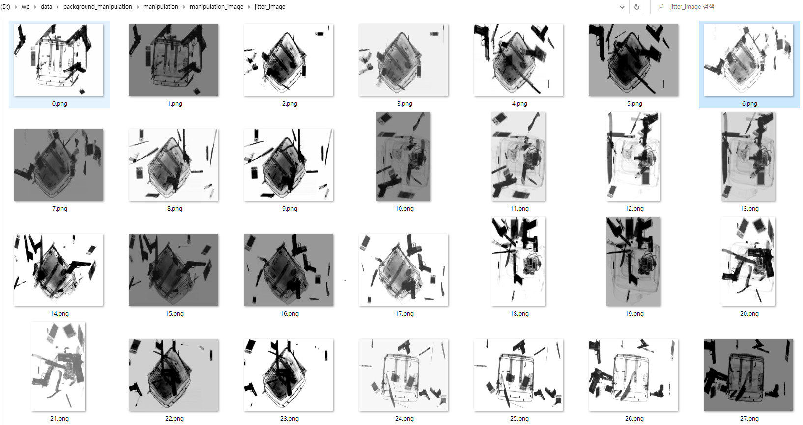

# 목차
1. [[data_augmentation]데이터 증강(rotate)](#data_augmentation-데이터-증강-1)
2. [[data_augmentation]groundtruths](#data_augmentation-추가-이미지-seg-bbox-시각적-표현-2)
3. [[data_augmentation]feedback](#data_augmentation-feedback-적용-3)
4. [[background_image]category 단일화](#background_image-augmentation--categorical-단일화-4)
5. [[background_image]manipulation](#background_image-manipulation-5)
6. [[background_image]high, low image size 맞추기](#background_image-categorical-low-high-이미지-사이즈-맞추기-6)
7. [[refactor]이미지 증강 코드 개선 및 모듈화, 폴더 정리](#refactor-이미지-증강-관련-코드-개선-및-모듈화-폴더-정리-7)
8. [[background_image]manipulation json 파일 생성](#background_image-manipulation-이미지-json-파일-생성-8)
9. [[background_image]manipulation 이미지 groundtruths](#background_image-manipulation-이미지-seg-bbox-시각적-표현-10)
10. [[study]pytorch study](#study-pytorch-11)
11. [[study]pytorch penfudanped](#study-penfudanped-12)
12. [[background_image]tran, val, test set 나누기](#background_image-train-val-test-set-13)
13. [[background_image]manipulation 이미지 전처리 학습](#background_image-manipulation한-데이터들-학습을-위해-변경-14)
14. [[mask_rcnn]cuda cudnn 설치](#mask_rcnn-cuda--cudnn-설치-15)
15. [[mask_rcnn]manipulation 이미지 학습](#mask_rcnn-object-detectionmanipulation-image-17)
16. [[mask_rcnn]manipulation 이미지 검증](#mask_rcnn-object-detectionmanipulation-image-2-18)
17. [[mask_rcnn]manipulation 이미지 검증 후 precision, recall 구하기](#mask_rcnn-object-detectionmanipulation-image-3-20)

## [data_augmentation] 데이터 증강 #1
**Closed** freenozero opened this issue on Jan 6 · 0 comments

### Description
crop 데이터 증강 하기(생성된 이미지 정보 crop_data.json에도 추가)
1.	특정 파일 이름 ex) "xray_scissors_5"을 img_name에 넣는다.
2.	해당 폴더에 crop에 저장된 이미지 숫자에서 +=1을 하며 갯수(n * 원본 이미지 개수)만큼 이미지 크기를 축소/확대하며 늘어난다.
아래의 조건에도 부합하게
1. xray_officeutilityknife_a_1: 1부터 시작함
2. xray_scissors_1: 숫자가 중구난방
4. xray_laserpointer_f_1: 30, 31이 없음

### Code
./data_augmentation/data_augmentation.py

### Example
- ./xray_scissors_5/crop (원본)

-> 원본 파일이 01353.png까지
- ./xray_scissors_5/crop (추가 이미지)

-> 추가된 파일은 01354.png부터

## [data_augmentation] 추가 이미지 seg, bbox 시각적 표현 #2
**Closed** freenozero opened this issue on Jan 6 · 0 comments

### Description
추가한 이미지의 bbox와 segmentation를 시각적으로 나타내기

### Code
data_augmentation/data_augmentation.py

### Result
add_image 폴더에서 늘어나게 한 이미지 json 파일이 seg, bbox 위치가 잘 되어있는지 확인 가능하다.

### Example
- ./xray_scissors_5/add_image


## [data_augmentation] feedback 적용 #3
**Closed** freenozero opened this issue on Jan 9 · 0 comments

- 함수 분할 후 클래스로 작성
1.	argc, argv 개념 정리
2.	매직 메소드
+) 4. 라이프 사이클 이해
+) 5. 디버깅 후 확인(무결성, 최적화)
- 코드 feedback
1.	이미지 불러올 때 아예 확장자로 불러오기
2.	이미지 리스트로 저장 후 사용
3.	enumerate 사용
4.	문자열은 f 문자로
5.	bbox[0,0] 말고 seg를 구해서 하도록 변경
- github feedback
1.	github 이모지 뜻 이해
2.	github read.me 변경

## [background_image] augmentation & categorical 단일화 #4
**Closed** freenozero opened this issue on Jan 10 · 0 comments

### Description
이전 milestones에 작성한 data_augmentation.py를 변형해서 카테고리당 10,000개씩 데이터를 늘린다. <br>
그리고 늘린 데이터는 아래의 4개 카테고리 폴더에 저장하며 0부터 9,999까지 순서대로 저장한다. (json 포함)<br>
0: knife: atknife, chefknife, fruitknife, jackknife, officeutilityknife, steakknife, swissarmyknife<br>
1: gun: gasgun, toygun<br>
2: bettery<br>
3: laserpointer

### Code
./manipulation/augmentation_categorical.py

### Result

-> 각각의 폴더에 crop, filter_image, json 폴더 존재

### Example


## [background_image] manipulation #5
**Closed** freenozero opened this issue on Jan 10 · 0 comments

### Description
카테고리 단일화 시킨 이미지와 background 이미지들을 합성시킨다.

### Code
./background_image/background_manipulation.py

### ETC
※ 연함: high, 진함: low 이미지 구분해서 합성시킨다. : high 먼저 저장 <br>
※ 총 20,000장을 만들지만 각 카테고리 이미지는 증강시킨 10,000(0~9,999)장을 사용한다. #총 카테고리 이미지는 40,000장
- 카테고리 당 0장에서 2장 랜덤으로 추출 (모든 카테고리가 0장이면 안된다)
- 한 카테고리가 총 이미지에 들어가는 갯수는 정해지지 않아도 카테고리 별로 큰 차이는 나면 안된다.
※ background인 가방을 벗어날 수는 있지만 이미지에서 벗어나면 안된다.<br>
※ 합칠 때 픽셀 하나에 다 나눈다. (max가 1이 되게)
- 이미지 합칠 때 1픽셀/max(픽셀)<255>
- 각 가방, 칼 등등의 max를 1로 되게 픽셀 하나를 다 나누기
- 이미지가 16비트면 16비트의 max값을 픽셀마다 다 나눠서 0~1로 만들고 합성하는 이미지와 곱한다.

<참고>
1.	https://bkshin.tistory.com/entry/OpenCV-9-%EC%9D%B4%EB%AF%B8%EC%A7%80-%EC%97%B0%EC%82%B0 
2.	https://www.binarystudy.com/2022/09/How-to-add-subtract-different-size-images-using-OpenCV-Python.html

### Result
- backgorund 이미지 1개
-  카테고리 별로 0개에서 2개 랜덤 추출한 뒤에 랜덤한 위치에 합성 (총 합성 카테고리 이미지는 1개~8개)


## [background_image] categorical low, high 이미지 사이즈 맞추기 #6
**Closed** freenozero opened this issue on Jan 13 · 0 comments
### Description
low, high 이미지 크기가 미세하게 차이가 나서 합성할 때 에러가 자주 뜨는 상황 <br>
해당 .py 재 작성해서 이미지 크기 똑같이 맞추기 <br>
※ bbox, seg 유의
### Code
./background_image/augmentation_categorical.py

## [refactor] 이미지 증강 관련 코드 개선 및 모듈화, 폴더 정리 #7
**Closed** 5 of 7 tasks freenozero opened this issue on Jan 13 · 0 comments

### Description
이미지 관련 코드 개선 및 모듈화
1. augmentation_categorical & data_augmentation<br>
• augmentation_categorical<br>
• data_augmentation<br>
original_image들을 aug하면서 카테고리 나눠서 categorical_image에 저장<br>

2. manipulation 
• manipulation_image에 있어야 하는 폴더, data.json 파일 생성, 만약에 있다면 초기화<br>
• manipulation: 이미지 합성 후 manipulation_image/highlow에 저장<br>
• jitter: highlow에 있는 image들을 jitter 후 저장<br>
• split: highlow에 저장된 image, jitter image, data.json들을 high, low로 나눠서 저장<br>
• groundtruths: highlow, high, low 폴더에 있는 jitter image들을 groundtruth하기

```
<이미지 폴더 정리>
data
    ㄴ original_image
        ㄴ bettery
            ㄴ xray_bettery_a_1
            ...
        ㄴ gun
            ㄴ xray_gasgun_a_1
            ...
        ㄴ knife
            ㄴ xray_artknife_a_1
            ...
        ㄴ laserpointer
            ㄴ xray_laserpointer_a_1
            ...
    ㄴ categorical_image
        ㄴ bettery
            ㄴ crop
            ㄴ ground_truth
            ㄴ json
        ㄴ gun
            ㄴ crop
            ㄴ ground_truth
            ㄴ json
        ㄴ knife
            ㄴ crop
            ㄴ ground_truth
            ㄴ json
        ㄴ laserpointer
            ㄴ crop
            ㄴ ground_truth
            ㄴ json
    ㄴ background_image
    ㄴ manipulation_image
        ㄴ highlow
            ㄴ train
                ㄴ image
                ㄴ jitter_image
                ㄴ ground_truth
                ㄴ json
            ㄴ val
                ㄴ image
                ㄴ jitter_image
                ㄴ ground_truth
                ㄴ json
            ㄴ test
                ㄴ image
                ㄴ jitter_image
                ㄴ ground_truth
                ㄴ json         
        ㄴ high
            ㄴ train
                ㄴ image
                ㄴ jitter_image
                ㄴ ground_truth
                ㄴ json       
            ㄴ val
                ㄴ image
                ㄴ jitter_image
                ㄴ ground_truth
                ㄴ json       
            ㄴ test
                ㄴ image
                ㄴ jitter_image
                ㄴ ground_truth
                ㄴ json       
        ㄴ low
            ㄴ train
                ㄴ image
                ㄴ jitter_image
                ㄴ ground_truth
                ㄴ json       
            ㄴ val
                ㄴ image
                ㄴ jitter_image
                ㄴ ground_truth
                ㄴ json       
            ㄴ test
                ㄴ image
                ㄴ jitter_image
                ㄴ ground_truth
                ㄴ json
```
### ETC
1. 사수님 예시 코드(참고해서 모듈화) https://github.com/airiss-data-analysis-with-intern/intern-task-development
2. python coding style http://pythonstudy.xyz/python/article/511-%ED%8C%8C%EC%9D%B4%EC%8D%AC-%EC%BD%94%EB%94%A9-%EC%8A%A4%ED%83%80%EC%9D%BC

## [background_image] manipulation 이미지 json 파일 생성 #8
**Closed** freenozero opened this issue on Jan 13 · 0 comments

### Description
#5 에서 합성 시키고 저장한 파일들을 토대로 data.json 파일 생성

### Code
./background_image/background_manipulation.py

### ETC
##### data.json 구조
1. image: crop 데이터 정보
- id: 1부터 계속 늘어남
- dataset_id: 계속 1
- path: 이미지 위치
- file_name: 이미지 이름
- width, height
2. categories
- id: id
- name: name <br>
{0: knife, 1: gun, 2: bettery, 3: laserpointer}
3. annotations
- id: annotation 아이디 0부터!
- image_id: image 아이디
- category_id: categories의 정보
- segmentation: 해당 사진 데이터 점들 x,y 정보가 차례로 저장
- area: w*h
- bbox: x, y, w, h

## [background_image] manipulation 이미지 seg, bbox 시각적 표현 #10
**Closed** freenozero opened this issue on Jan 16 · 0 comments

### Description
- #5 의 이미지를 (#6 을 활용해서)카테고리 별로 색깔 다르게 seg, bbox 시각적으로 나타내기
{0: knife, 1: gun, 2: bettery, 3: laserpointer}<br>
{red(255, 0, 0), blue(0, 0, 255), yellow(255, 255, 0), green(0, 255, 0)}<br>
##### After manipulation color
1.	knife: blue
2.	gun: red
3.	bettery: mint
4.	laswerpointer: green

### Code
./background_image/groundtruths.py

### Result


##### Example
- ./groound_truths/108.png
- high


- ./ground_truths/109.png
- low


## [study] pytorch #11
**Closed** freenozero opened this issue on Jan 17 · 0 comments

### Description
etc 링크를 통해 pytorch vision 공부
##### Code Folder
- ./tutorials_pytorch/pytorch(beginner)/...
- ./tutorials_pytorch/image_video(intermediate)/...

### ETC
https://tutorials.pytorch.kr/intermediate/torchvision_tutorial.html

## [study] PenFudanPed #12
**Closed** freenozero opened this issue last month · 0 comments

### Description
- ETC에 적힌 예제 코드 폴더를 이용해서 PenFudanPed 예제 object-detection 해보고 이해하기
- example code2 clone 코딩하기

### Code
##### example code1
•	./pytorch_fintuning_example/Pytorch-Object-Detection-Fintuning-Tutorial-1/... <br>
•	github: https://github.com/MizzleAa/Pytorch-Object-Detection-Fintuning-Tutorial-1 <br>
•	tistory: https://mizzlena.tistory.com/38 <br>
##### example code2
•	./pytorch_fintuning_example/Pytorch-Object-Detection-Fintuning-Tutorial-2/... <br>
•	github: https://github.com/MizzleAa/Pytorch-Object-Detection-Fintuning-Tutorial-2 <br>
•	tistory: https://mizzlena.tistory.com/39 <br>
##### example code2-clone
•	./pytorch_fintuning_example/Pytorch-Object-Detection-Fintuning-2-clone/... <br>
•	github: https://github.com/MizzleAa/Pytorch-Object-Detection-Fintuning-2-clone <br>

### ETC
•	image: PenFudanPed(https://www.cis.upenn.edu/~jshi/ped_html/)

### Result


## [background_image] train, val, test set #13
**Closed** freenozero opened this issue last month · 0 comments

### Description
•	[background_image] manipulation한 데이터들 학습을 위해 변경 #14 까지 완료한 이미지들을 학습하기 위해 train, val, test set으로 이미지를 나눈다. <br>
8:1:1 비율로 나눈다. <br>
16,000: 2,000: 2,000 <br>
•	low, high 이미지도 나눠서 관리한다. <br>
8,000: 1,000: 1,000

### Code
manipulation\library\split.py

### ETC
```
data
    ㄴ manipulation_image
        ㄴ highlow
            ㄴ train
                ㄴ image
                ㄴ jitter_image
                ㄴ ground_truth
                ㄴ json
            ㄴ val
                ㄴ image
                ㄴ jitter_image
                ㄴ ground_truth
                ㄴ json
            ㄴ test
                ㄴ image
                ㄴ jitter_image
                ㄴ ground_truth
                ㄴ json         
        ㄴ high
            ㄴ train
                ㄴ jitter_image
                ㄴ ground_truth
                ㄴ json       
            ㄴ val
                ㄴ jitter_image
                ㄴ ground_truth
                ㄴ json       
            ㄴ test
                ㄴ jitter_image
                ㄴ ground_truth
                ㄴ json       
        ㄴ low
            ㄴ train
                ㄴ jitter_image
                ㄴ ground_truth
                ㄴ json       
            ㄴ val
                ㄴ jitter_image
                ㄴ ground_truth
                ㄴ json       
            ㄴ test
                ㄴ jitter_image
                ㄴ ground_truth
                ㄴ json
```

## [background_image] manipulation한 데이터들 학습을 위해 변경 #14
**Closed** freenozero opened this issue last month · 0 comments
### Description
(#13 을 하기 위해서 manipulation 데이터들 변경) <br>
1. json 파일을 수정 <br>
변경 사항 및 중요한 부분은 ETC에 굵음 표시 <br>
2. 합성할 때 카테고리 당 최소 3개에서 5개로 변경 <br>
즉, 이미지 하나에 들어가는 카테고리는 총 12~20개 <br>
3. color jettering
low, high 상관 없이 color jitter를 랜덤으로 <br>
https://pytorch.org/vision/main/generated/torchvision.transforms.ColorJitter.html

### ETC
data.json 구조
1. image
- id: 0부터 계속 늘어남 중복 없어야함
- dataset_id: 계속 1
- path: 이미지 위치
- file_name: 이미지 이름
- width, height
2. categories
- id: 0부터 계속 늘어남 중복 없어야함
- name: name
{1: knife, 2: gun, 3: bettery, 4: laserpointer} (1부터 시작)
3. annotations
- id: annotation 아이디 0부터! 중복 없어야함
- image_id: image 아이디
- category_id: categories의 정보(1이면 knife)
- segmentation: 해당 사진 데이터 점들 x,y 정보가 차례로 저장
- area: w*h
- bbox: x0, y0, w, h

### Result
### Example
이미지 하나에 들어가는 카테고리는 총 12~20개

##### manipulation


###### groundtruths


##### color jitter


###### groundtruths


## [mask_rcnn] CUDA + cuDNN 설치 #15
**Closed** freenozero opened this issue last month · 0 comments
### Description
GPU: NVIDIA GeForce RTX 3090
- Compute Capability: 8.6
- CUDA SDK 11.1 – 11.4 *<CUDA SDK 11.1 – 11.4 support for compute capability 3.5 – 8.6 (Kepler (in part), Maxwell, Pascal, Volta, Turing, Ampere (in part))>*

##### 설치 코드
ERROR: Could not find a version that satisfies the requirement torch==1.13.1+cu117 (from versions: 1.7.1, 1.8.0, 1.8.1, 1.9.0, 1.9.1, 1.10.0, 1.10.1, 1.10.2, 1.11.0, 1.12.0, 1.12.1, 1.13.0, 1.13.1) ERROR: No matching distribution found for torch==1.13.1+cu117 
<br>
- python -m pip install torch==1.13.1+cu117 torchvision==0.14.1+cu117 -f https://download.pytorch.org/whl/torch_stable.html

### ETC
cpu로 했을 때보다 진짜 빠르다... <br>
1.	https://leonam.tistory.com/98
2.	https://mizzlena.tistory.com/entry/%EC%9D%B8%EA%B3%B5%EC%A7%80%EB%8A%A5-Pytorch-Install
<br>
--------------------------이사-------------------------
<br>
•	Compute Capability: 6.1
•	CUDA SDK 11.1 – 11.4 새로 설치

## [mask_rcnn] object-detection(manipulation image) #17
**Closed** freenozero opened this issue 3 weeks ago · 0 comments

### Description
예제 코드 COMMON_AI를 참고해서 manipulation image들을 학습, 검증 코드 작성한다.

### Code
mask_cnn

### ETC
```
data
    ㄴ manipulation_image
        ㄴ highlow
            ㄴ train
                ㄴ image
                ㄴ jitter_image
                ㄴ ground_truth
                ㄴ json
            ㄴ val
                ㄴ image
                ㄴ jitter_image
                ㄴ ground_truth
                ㄴ json
            ㄴ test
                ㄴ image
                ㄴ jitter_image
                ㄴ ground_truth
                ㄴ json         
        ㄴ high
            ㄴ train
                ㄴ jitter_image
                ㄴ ground_truth
                ㄴ json       
            ㄴ val
                ㄴ jitter_image
                ㄴ ground_truth
                ㄴ json       
            ㄴ test
                ㄴ jitter_image
                ㄴ ground_truth
                ㄴ json       
        ㄴ low
            ㄴ train
                ㄴ jitter_image
                ㄴ ground_truth
                ㄴ json       
            ㄴ val
                ㄴ jitter_image
                ㄴ ground_truth
                ㄴ json       
            ㄴ test
                ㄴ jitter_image
                ㄴ ground_truth
                ㄴ json
```
### Result
##### Example


## [mask_rcnn] object-detection(manipulation image) 2 #18
**Closed** 5 tasks done freenozero opened this issue 2 weeks ago · 0 comments

### Description
- 주어진 실 촬영 데이터인 test 이미지로 검증하기
1. background image들을 700x700으로 변경해서 합성 이미지 만들기)
2. manipulation image들은 9:1과 8:2 비율로 train, val 폴더 분리하기
3. test 이미지 groundtruth하기(knife:보라, gun:빨강, battery: 민트, laserpointer: 연초록으로 나타남)  <br>
4. 학습 후 test 이미지로 검증하기 <br>
5. IOU=0.5 이상일 때 각 카테고리 별로 Average precision, Average recall 구하기 <br>
https://velog.io/@joon10266/Objection-Detection-mAP%EB%9E%80 <br>
https://lapina.tistory.com/98 <br>
https://herbwood.tistory.com/2 <br>

- main의 340번째 줄에서 구한 json_data 예시이다. predictions에서 score가 0.5인 것들이 저장되어 있는데 이것을 이용해서 처음부터 구현해보기..!
1.	iou 구하기
2.	confusion matrix 구하기
3.	recall, precision 구하기

```
{'boxes': [array([248.92194, 215.11569, 341.88998, 462.15182], dtype=float32), 
array([313.30914, 164.37004, 420.69952, 334.37543], dtype=float32),
array([197.76933, 405.19885, 309.72058, 501.4165 ], dtype=float32),
array([354.68762, 348.2364 , 400.53427, 429.05948], dtype=float32),
array([396.65244, 294.18842, 452.76904, 349.66107], dtype=float32),
array([396.8408 , 238.89511, 433.8597 , 341.11755], dtype=float32),
array([416.8089 , 293.75836, 452.209 , 327.09152], dtype=float32),
array([395.8528, 237.3463, 433.5417, 308.0898], dtype=float32),
array([415.41946, 245.76591, 443.16995, 335.99905], dtype=float32),
array([219.66817, 124.49312, 313.2634 , 295.11   ], dtype=float32)],
'masks': [array([[[0, 0, 0, ..., 0, 0, 0],
        [0, 0, 0, ..., 0, 0, 0],
        [0, 0, 0, ..., 0, 0, 0],
        ...,
        [0, 0, 0, ..., 0, 0, 0],
        [0, 0, 0, ..., 0, 0, 0],
        [0, 0, 0, ..., 0, 0, 0]]], dtype=uint8), array([[[0, 0, 0, ..., 0, 0, 0],
        [0, 0, 0, ..., 0, 0, 0],
        [0, 0, 0, ..., 0, 0, 0],
        ..., dtype=uint8)],
'scores': [array(0.9999877, dtype=float32), array(0.9999443, dtype=float32),
array(0.99882287, dtype=float32), array(0.9409943, dtype=float32),
array(0.8265976, dtype=float32), array(0.7886496, dtype=float32),
array(0.60963416, dtype=float32), array(0.599601, dtype=float32),
array(0.54668903, dtype=float32), array(0.5215575, dtype=float32)],
'labels': [array(2, dtype=int64), array(1, dtype=int64),
array(1, dtype=int64), array(4, dtype=int64),
array(1, dtype=int64), array(1, dtype=int64),
array(1, dtype=int64), array(4, dtype=int64),
array(1, dtype=int64), array(1, dtype=int64)]}
```

### ETC
train, val의 data.json 구조
1. image
- id: 0부터 계속 늘어남 중복 없어야함
- dataset_id: 계속 1
- path: 이미지 위치
- file_name: 이미지 이름
- width, height

2. categories
- id: 0부터 계속 늘어남 중복 없어야함
- name: name <br>
{1: knife, 2: gun, 3: bettery, 4: laserpointer} (1부터 시작)

3. annotations
- id: annotation 아이디 0부터! 중복 없어야함
- image_id: image 아이디
- category_id: categories의 정보(1이면 knife)
- segmentation: 해당 사진 데이터 점들 x,y 정보가 차례로 저장
- area: w*h
- bbox: x0, y0, w, h

### Result
##### min_score: 0.9

- groundtruth한 test 이미지

- 예측한 이미지


```
knife precision: 0.09861386138613862
gun precision: 0.4307116104868914
battery precision: 0.21674876847290642     
laserpointer precision: 0.12139107611548557
knife recall: 0.672972972972973
gun recall: 0.6307129798903108
battery recall: 0.7135135135135136
laserpointer recall: 0.625
```

##### min_score: 0.5


```
knife precision: 0.06981637337413925
gun precision: 0.42812006319115326
battery precision: 0.16589861751152074
laserpointer precision: 0.1027516544757924
knife recall: 1.0
gun recall: 0.9963235294117647
battery recall: 1.0
laserpointer recall: 0.9966216216216216
```

※ 문제점: 오 탐지되는 것이 너무 많다...

- 주어진 test 이미지가 아니고 만든 manipulation image를 8:1:1 비율로 했을때


```
knife precision: 0.8706331226898771
gun precision: 0.9515090289177927
battery precision: 0.9555693069306931     
laserpointer precision: 0.9020155415250122
knife recall: 0.9414646725116039
gun recall: 0.9613421791273284
battery recall: 0.9752431476569408        
laserpointer recall: 0.9365859808371155   
```

주어진 test 이미지가 다르게 생겨서 그런 것 같고 precision recall을 구하는 방식이 잘 못 되어 있는 것 같다.

## [mask_rcnn] object-detection(manipulation image) 3 #20
**Closed** freenozero opened this issue 2 weeks ago · 0 comments

### Description
precision, recall 구하는 함수 다시 작성 -> IOU=0.5 이상일 때 각 카테고리 별로 Average precision, Average recall 구하기 <br>
https://velog.io/@joon10266/Objection-Detection-mAP%EB%9E%80<br>
https://lapina.tistory.com/98<br>
https://herbwood.tistory.com/2

### Result
#### jitter_image 8:1:1
- knife_pr_curve

- gun_pr_curve

- batter_pr_curve

- laserpointer_pr_curve

- AP


#### jitter_image 9:1
(만든 것과 다른 test 이미지 결과)
- knife_pr_curve

- gun_pr_curve

- batter_pr_curve

- laserpointer_pr_curve

- AP

