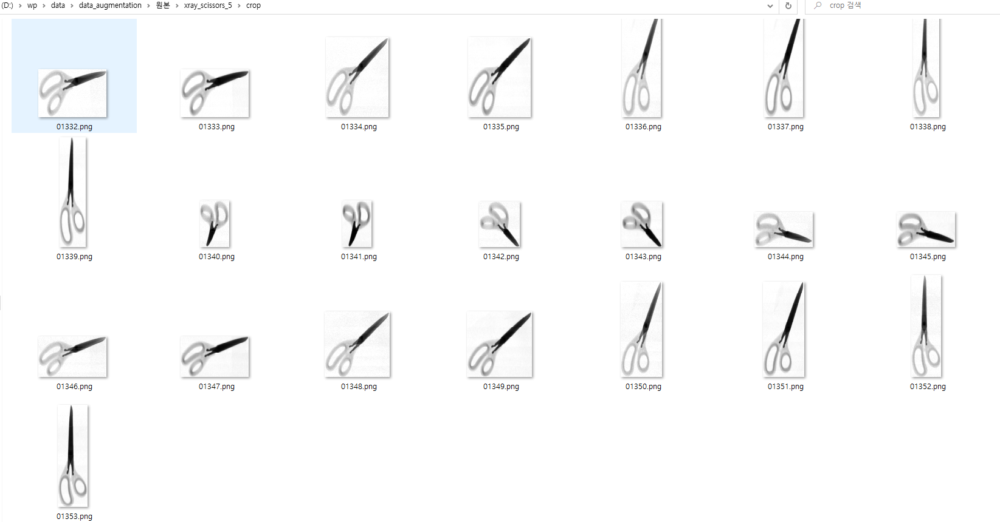

# [data_augmentation] 데이터 증강 #1
**Closed**   freenozero opened this issue on Jan 6 · 0 comments

## Description
crop 데이터 증강 하기(생성된 이미지 정보 crop_data.json에도 추가)
1.	특정 파일 이름 ex) "xray_scissors_5"을 img_name에 넣는다.
2.	해당 폴더에 crop에 저장된 이미지 숫자에서 +=1을 하며 갯수(n * 원본 이미지 개수)만큼 이미지 크기를 축소/확대하며 늘어난다.
아래의 조건에도 부합하게
1. xray_officeutilityknife_a_1: 1부터 시작함
2. xray_scissors_1: 숫자가 중구난방
4. xray_laserpointer_f_1: 30, 31이 없음

## Code
./data_augmentation/data_augmentation.py

## Example
- ./xray_scissors_5/crop (원본)

